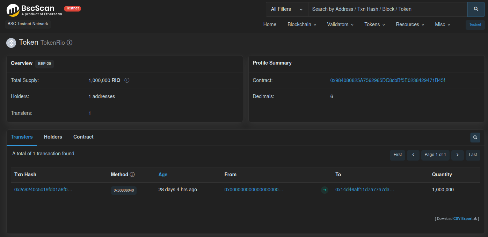

# Token ERC-20

ERC significa Ethereum token standards (padrões de token Ethereum).

Esses padrões demonstram certas regras que todo token Ethereum deve tolerar, e essas são diretrizes técnicas aplicáveis para todos que quiserem criar um token no ecossistema Ethereum.

## Tokens fungíveis

Tokens ERC-20 foi o primeiro padrão de token que a blockchain Ethereum introduziu para permitir a criação de tokens fungíveis.

## Eles podem ser:
- Tickets para um campeonato ou esquema online.

- Ativos financeiros da vida real, como ações de uma empresa, dividendos, etc.

- Pontos de reputação de jogos online

## Deploy:

o Deploy desse token foi realizado atraves da ide REMIX, na rede de testes. A seguir segue a imagem com detalhes

